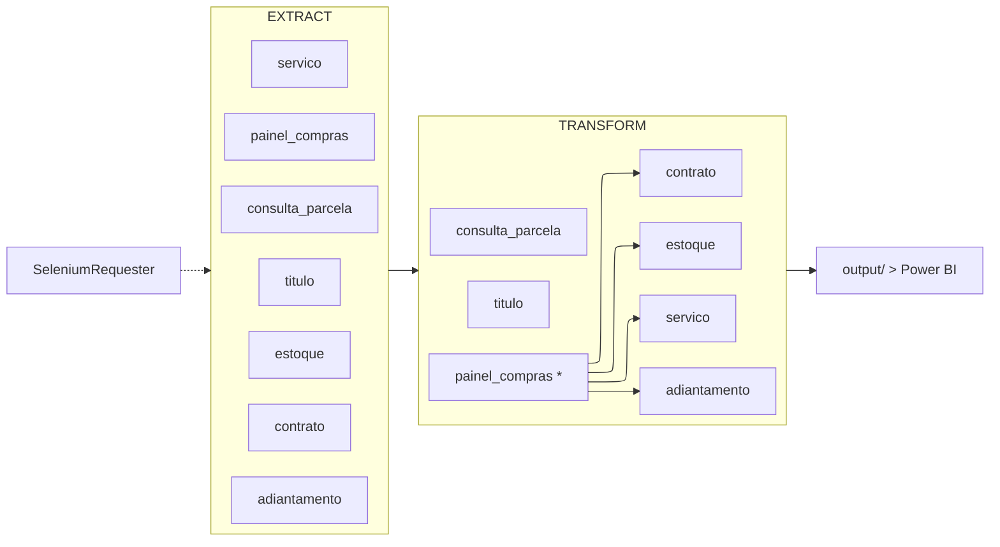

# ETL SIENGE → Power BI

Pipeline de extração e transformação dos dados do SIENGE para consumo no Power BI.

> Compatível com **SIENGE versão 9.0.4-5 (build 4399)**. Usuários de outras versões podem enfrentar incompatibilidades nos seletores CSS/XPath.

---

## Fluxo do Pipeline



> **\*** `transform_painel_compras` deve rodar primeiro — gera `dim_obra`, `dim_insumo` e `dim_grupo_insumo` que os demais transforms consomem.

> **Nota:** A etapa de Load atualmente entrega os dados via arquivos CSV em `output/`. A migração para banco de dados relacional está planejada para uma próxima fase.

---

## Estrutura

```
etl_sienge/
│
├── main.py                            ← orquestrador do pipeline
├── logs/                              ← logs de execução por painel
│
├── src/
│   └── drivers/
│       └── selenium_requester.py      ← driver Edge + helpers reutilizáveis
│
└── stages/
    ├── extract/
    │   ├── reference/
    │   │   ├── dim_empresa.csv        ← empresas para loop do adiantamento/título
    │   │   └── obras_estoque.csv      ← obras para filtro do estoque
    │   │
    │   ├── extract_painel_compras.py
    │   ├── extract_estoque.py
    │   ├── extract_servico.py
    │   ├── extract_contrato.py
    │   ├── extract_adiantamento.py
    │   ├── extract_consulta_parcela.py
    │   └── extract_titulo.py
    │
    └── transform/
        ├── input/                     ← arquivos brutos (saída do extract)
        └── output/                    ← tabelas prontas para o Power BI
```

---

## Paineis e Agendamento

O pipeline está dividido em dois paineis independentes, cada um com seu próprio `.bat` para agendamento no Windows Task Scheduler:

| Painel | Bat | Etapas |
|---|---|---|
| Financeiro | `consultas_execucao.bat` | consulta_parcela + titulo |
| Suprimentos | `suprimentos_execucao.bat` | painel_compras + estoque + servico + contrato + adiantamento |

Logs gerados em `logs/consultas_execucao.log` e `logs/suprimentos_execucao.log`.

---

## Uso

```bash
# Painel completo
python main.py --etapa painel_consultas
python main.py --etapa painel_suprimentos

# Etapas individuais — extract
python main.py --etapa extract_painel_compras
python main.py --etapa extract_estoque
python main.py --etapa extract_servico
python main.py --etapa extract_contrato
python main.py --etapa extract_adiantamento
python main.py --etapa extract_consulta_parcela
python main.py --etapa extract_titulo

# Etapas individuais — transform
python main.py --etapa transform_painel_compras
python main.py --etapa transform_estoque
python main.py --etapa transform_servico
python main.py --etapa transform_contrato
python main.py --etapa transform_adiantamento
python main.py --etapa transform_consulta_parcela
python main.py --etapa transform_titulo

# Data de início customizada
python main.py --etapa extract_painel_compras --data-inicio 01/01/2024
```

---

## Resiliência

- Cada etapa executa com **retry automático** (2 tentativas, 30s de intervalo)
- Extractors com loop por empresa (`titulo`, `adiantamento`) reiniciam o driver isoladamente em caso de sessão corrompida, sem perder o progresso das empresas já processadas
- Arquivos já baixados são pulados automaticamente no rerun

---

## Pré-requisitos

- Python 3.12+
- Microsoft Edge + EdgeDriver compatível
- Perfil Edge com sessão do SIENGE salva em `C:\SeleniumPerfil\Edge`

```bash
pip install -r requirements.txt
```

---

## Helpers — SeleniumRequester

| Método | Descrição |
|---|---|
| `navegacao_inicial` | Login e seleção de perfil |
| `aguardar_e_clicar` | Espera elemento clicável e clica |
| `preencher_campo` | Limpa e preenche campo de texto |
| `aguardar_download` | Aguarda arquivo aparecer na pasta de downloads |
| `exportar_csv_modal` | Sequência padrão do modal de exportação |
| `selecionar_todas_colunas` | Abre seletor de colunas MUI e marca todas |
| `aguardar_carregamento_tabela` | Aguarda spinner do MuiDataGrid sumir |
| `fechar_popup_novidade` | Fecha o MuiDialog de novidade quando presente |
| `verificar_sem_dados` | Detecta ausência de dados (alert nativo ou div alerta) |
| `reiniciar_driver` | Encerra driver corrompido e sobe um novo já navegado |
| `scrollar_pagina` | Scroll no container principal |

---

## Contribuindo

Melhorias e correções são bem-vindas. Abra uma issue ou envie um PR.

Lembrando que o pipeline foi desenvolvido e testado exclusivamente no **SIENGE versão 9.0.4-5 (build 4399)** — mudanças na estrutura do HTML/CSS do SIENGE em outras versões podem quebrar os seletores sem aviso prévio.